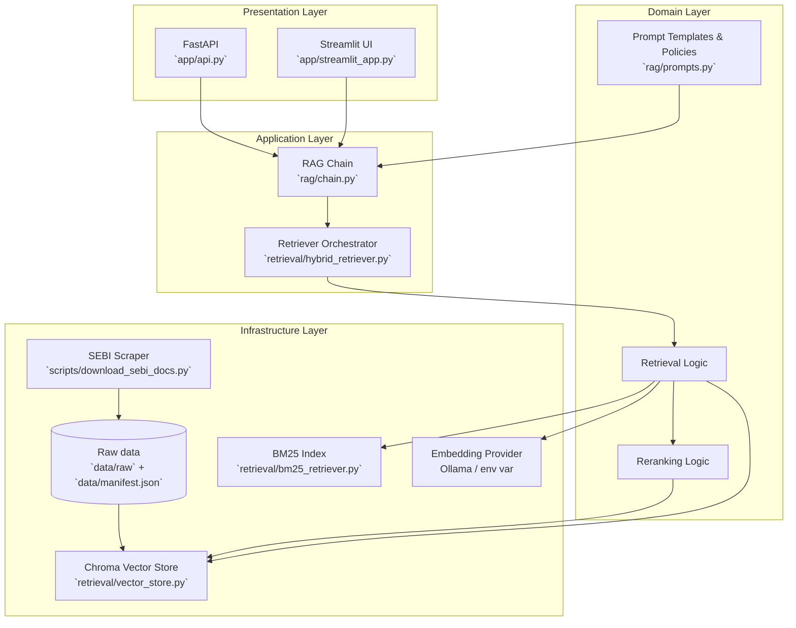

# hybrid-rag-project

A hybrid Retrieval-Augmented Generation (RAG) project focused on SEBI regulations and compliance. It combines BM25 keyword search with dense embeddings (Chroma) and optional local reranking to provide accurate, source-backed answers via a Streamlit UI and a FastAPI endpoint.

## Features
- Ingestion pipeline: load PDFs/TXT/DOCX, chunk, enrich metadata
- Dual retrieval: BM25 (sparse) + Chroma embeddings (dense) with an `alpha` blend
- Optional local reranking using a cross-encoder (BGE)
- RAG chain that returns answers plus source excerpts
- Streamlit chat UI and FastAPI endpoints for ingestion and queries

## Quickstart
1. Create and activate a Python virtual environment

```bash
python -m venv .venv
source .venv/Scripts/activate   # Windows: .venv\Scripts\activate
pip install -r requirements.txt
```

2. Prepare data
- Put source files into `data/processed/filtered` or run the project ingestion helpers.

### Data source (SEBI scraping)
- This project includes a scraper to download SEBI circulars and regulations into `data/raw`.
- Script: `scripts/download_sebi_docs.py` — it crawls SEBI listing pages, extracts PDF links, and saves files to `data/raw` while maintaining a `data/manifest.json`.
- Run the scraper:

```bash
python scripts/download_sebi_docs.py
```

- After downloading, run the ingestion pipeline to process and filter documents into `data/processed/filtered`.
- Respect website terms and rate limits: the downloader includes throttling (see `DELAY_BETWEEN_REQUESTS` in the script). Use responsibly and check SEBI's terms of use before scraping.

3. Run ingestion (build embeddings + BM25 index)

```bash
python ingestion/ingest_pipeline.py
```

Or use the API ingestion endpoint:

```bash
uvicorn app.api:app --reload --port 8000
# then POST files to http://localhost:8000/ingest
```

4. Start the Streamlit UI

```bash
streamlit run app/streamlit_app.py
```

5. Query programmatically via the API

```bash
uvicorn app.api:app --reload --port 8000
# POST /query -> returns answer + sources
``` 
Brief workflow steps:
- Ingestion: `ingestion/ingest_pipeline.py` loads files, chunks, enriches metadata, embeds, and builds BM25.
- Indexing: embeddings persist to Chroma (`./chroma_db`) and sparse index is built for BM25.
- Retrieval: `retrieval/hybrid_retriever.py` combines BM25 and dense retriever with `alpha` weighting.
- Reranking: optional local cross-encoder reranker boosts top-N results.
- RAG chain: `rag/chain.py` formats docs, prompts LLM, and returns answer + sources to the frontend.

## Project analysis
- Purpose: Provide a domain-focused RAG assistant for SEBI regulations with local-first tooling (Chroma + optional local reranker) to reduce API costs and keep data on-device.
- Strengths: hybrid retrieval (sparse + dense), local reranker option, both UI and API endpoints, modular ingestion pipeline.
- Assumptions & requirements: Ollama embeddings or a compatible embedding provider; local model availability for reranker if `USE_LOCAL_RERANK=true`.
- Potential improvements: add automated tests for ingestion and retrieval, CI to persist `chroma_db` as an artifact, and clearer example requests for the API.

## Clean Architecture (layered view)


Notes: The Clean Architecture emphasizes separation of concerns — Presentation (UI/API) depends on Application services (RAG chain + retriever orchestration), which operate on Domain abstractions (retrieval, reranking, prompting). Infrastructure (Chroma, BM25, embedding provider) is injected at runtime and can be swapped with adapters.

## Important files
- `config.py` — central configuration (chunk size, alpha, models)
- `ingestion/ingest_pipeline.py` — runs loader, chunker, embed+store, BM25 builder
- `retrieval/vector_store.py` — embeddings + Chroma glue
- `retrieval/bm25_retriever.py` — BM25 index / loader
- `retrieval/hybrid_retriever.py` — blends sparse + dense retrievers
- `retrieval/reranker.py` — optional local cross-encoder reranker
- `rag/chain.py` — constructs the RAG chain used by UI and API
- `app/streamlit_app.py` — Streamlit chat UI
- `app/api.py` — FastAPI endpoints (`/ingest`, `/query`)

## Configuration
- Edit `config.py` or set environment variables to configure models, chunk sizes, and reranker behavior. Notable variables: `CHUNK_SIZE`, `ALPHA`, `EMBED_MODEL`, `USE_LOCAL_RERANK`, `LOCAL_RERANK_MODEL`.

## Tips & Troubleshooting
- If embeddings fail, check `EMBED_MODEL` and your local Ollama/embedding provider setup.
- Large datasets: ingestion batches documents (see `retrieval/vector_store.py` BATCH_SIZE) to avoid OOM.
- If the reranker download fails (network), the system will fall back to hybrid retrieval (no rerank).
